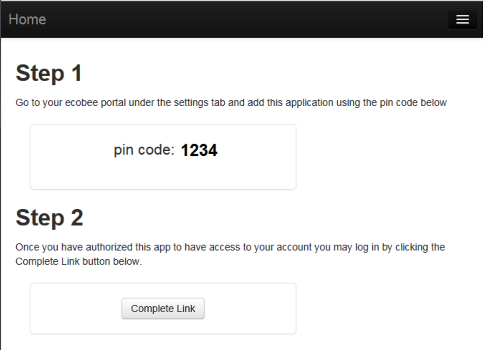
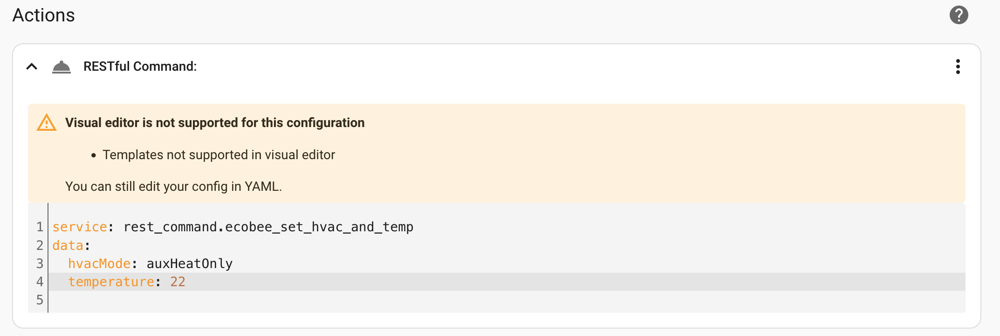

# Home Assistant Ecobee Bridge 

### NOTES: 
* This project is still in development, its a good proof of concept that can be used. This project is open source, you can improve it by creating Pull Request.
* The base of the project is from [https://github.com/OutsourcedGuru/ecobee-app](https://github.com/OutsourcedGuru/ecobee-app)


## Description

This is a simple nodejs server used to control an Ecobee thermostat from Home assistant.

Home Assistant enables you to control some basic feature of an Ecobee thermostat, but can't set
for example the Ecobee mode to AUX.

This proxy servers receive REST/HTTP request from HA and sends them to the Ecobee API. Using this proxy server any functionnality of the Ecobee API can be accessed from HA.


### `ecobeeConfig.json`
This nodejs server will keep in a local file (`ecobeeConfig.json`) all the required information to access the Ecobee API.
In the following setup, some private data will be written on this JSON file. Be certain to not make that file public since it contains authorization information to access your Ecobee thermostat.

This JSON file contains all the server's required information to access the Ecobee API, so the setup will needs to be done only once.


## Set up

* `npm install`
* `npm start`


* Open a web page to that server (ex: `http://localhost:3000/`)
	* The first time you will need to setup the Ecobee application:
		* Copy the displayed PIN code (ex: RRWV-KJKD)
		
		
		
		* Go to the Ecobee website and signin on your account.
			* From the menu select "My Apps"
			* Select "Add Application" button
			* Enter the PIN code (ex: RRWV-KJKD)
			* A confirmation page will be displayed, select "Confirm".
			* A Congratulation page will be displayed
		* Returns on your nodejs server webpage
			* Press the "Complete Link" button.
			* Your list of Ecobee thermostat should now be visible.

You are now ready to sends HTTP request from HA!

## Changing the MODE and the hold temperature

Before using HA, you can test this using a tool such as `Postman`

* Create a request of type: `POST http://[YOUR_SERVER_ADDRESS]/thermostats/[THERMOSTAT_ID]/sethold?hvacmode=heat&holdtemp=21`
	* `YOUR_SERVER_ADDRESS`: Its your nodejs server IP (ex: `http://localhost:3000`)
	* `THERMOSTAT_ID`: Its your thermostat Id. You can retrieves your list of thermostats and their ids at `http://localhost:3000/thermostats`
	* `hvacmode`: `heat` or `auxHeatOnly`
	* `holdtemp`: Optional parameter specifying the hold temperature in celcius.


## Setup Home assistant

### Setup REST commands

Add this section in your HA `configuration.yaml` file to setup all REST commands

```
rest_command:
  # Set the mode only
  ecobee_set_hvac:
    url: "http://[YOUR_SERVER_ADDRESS]/thermostats/[THERMOSTAT_ID]/sethold"
    method: post
    content_type: 'application/x-www-form-urlencoded'
    payload: "hvacmode={{ hvacMode }}"

  # Set the mode and the hold temperature
  ecobee_set_hvac_and_temp:
    url: "http://[YOUR_SERVER_ADDRESS]/thermostats/[THERMOSTAT_ID]/sethold"
    method: post
    content_type: 'application/x-www-form-urlencoded'
    payload: "hvacmode={{hvacMode}}&holdtemp={{temperature}}"
```

Restart Home assistant to apply the configuration change.


### Use REST commands

### In `automations.yaml`

In your automations file `automations.yaml` you can add a `service` like these:

```
  # Set HVAC mode to HEAT
  - service: rest_command.ecobee_set_hvac_and_temp
    data:
      hvacMode: "heat"

  # Set HVAC mode to AUX at 22
  - service: rest_command.ecobee_set_hvac_and_temp
    data:
      hvacMode: "auxHeatOnly"
      temperature: 22
```

#### Using the Editor



